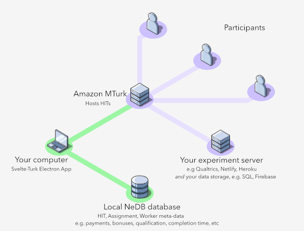

# Svelte-Turk

🚧 Work in Progress 🚧

## [Development Roadmap](https://trello.com/b/Ha9M431u)  

### [docs and project website (in progress)](https://www.notion.so/ejolly/Svelte-Turk-6c250e6f736642b0a1271c027514d5fb)  

Svelte-Turk is a desktop application for interacting with [Amazon's Mechanical Turk](https://www.mturk.com/) service (e.g. creating HITs, contacting workers, getting HIT and Assignment meta-data etc). Designed to be a lightweight and simple tool for managing Mturk without the need to write any code, setup any servers, databases, etc. The goal of the project is to offer a modern graphical alternative to something like [PsiTurk](https://psiturk.org/).  

*Note: Svelte Turk is **not** an experiment/survey builder or deployment tool. Users are left to manage this themselves using whatever services they prefer. All Svelte Turk needs is an HTTPS URL pointing to your experiment/survery in order to create HITs. This is accomplished via the [External Question](https://docs.aws.amazon.com/AWSMechTurk/latest/AWSMturkAPI/ApiReference_ExternalQuestionArticle.html) option in MTurk. See the figure below for a visual explanation.*

Built using [Electron](https://www.electronjs.org/) to provide cross OS compatibility. Interactivity and design is implemented using [SvelteJS](https://svelte.dev/) with styles and layouts implemented using [TailwindCSS](https://tailwindcss.com/). All data is stored **locally** using [Nedb](https://github.com/louischatriot/nedb).  

  
**Fig 1.** *Svelte-Turk only handles nodes and connections highlighted in green, namely the creation and management of HITs via communication with MTurk and a local database. It's up to you to build your experiment or survey and store appropriate data as see you see fit. (figure made with [isoflow](https://isoflow.io/))*

## Usage

In order to use the app you need to obtain and make your AWS credentials available. You can follow the directions on the [psiturk website](https://psiturk.readthedocs.io/en/stable/amt_setup.html) to do this. Once you have them either:
- export them to the environment variables: `AWS_ACCESS_KEY_ID` and `AWS_SECRET_ACCESS_KEY`
- Save them in a `.awscredentials.json` file in your home directory (i.e. the `~` directory on macOS.) The contents of this file should look like:
```
{
    "accessKeyId": "yourKey",
    "secreteAccessKey": "yourSecret"
}
```

Svelte-turk will look for these credentials in the order described above, i.e. will prefer environment variables if it sees them and only fall back to `.awscredentials.json` if it doesn't. If both are specified, environment variables will always take precedence.

If you are unsure if you have set these credentials properly, simply start the app, as Svelte-Turk will issue an error message if it can't locate credentials through either method. Simply set them up according to the instructions above and restart the app to get going!

## Project structure

- `main/`
  - contains code for the electron server, the skeleton html file that svelte renders to, and nedb files
- `renderer/`
  - contains all code for the svelte app (e.g. pages and components)

## Development Log

1. Install [npm](https://www.npmjs.com/get-npm) (if you don't have it)
2. Install [entr](http://eradman.com/entrproject/) `brew install entr` on macOS
3. Bootstrap electron-forge starter `npx create-electron-app svelte-turk`
4. Install dependencies and devDependencies: `cd svelte-turk && npm install --save-dev electron-reload eslint eslint-config-airbnb eslint-plugin-import eslint-plugin-jsx-a11y eslint-plugin-react eslint-plugin-svelte3 prettier rollup rollup-plugin-livereload rollup-plugin-postcss rollup-plugin-node-resolve rollup-plugin-svelte rollup-plugin-terser rollup-plugin-commonjs svelte concurrently @fullhuman/postcss-purgecss postcss postcss-load-config svelte-preprocess tailwindcss`
5. Configure tailwind and postcss using [this guide](https://dev.to/sarioglu/using-svelte-with-tailwindcss-a-better-approach-47ph)
6. Launch the app with `npm run start` 

Icons are sourced from [hero icons](https://heroicons.dev/) and [tabler icons](https://tablericons.com/)  

### Note on hot-reloading

`electron-reload` is configured to just watch the renderer directory (i.e. Svelte) and will auto-refresh to any changes made to the svelte code. `entr` is used to restart the entire electron server on any changes to the `main.js` file which is the main electron process ("server").  

If you encounter issues in which changes to the front-end svelte code are not updating the app it's likely because you have an orphaned rollup process running in the background. Just use your favorite method (e.g. `ps aux | grep rollup`, `procs`, etc) to find it and kill it and then relaunch the app.
