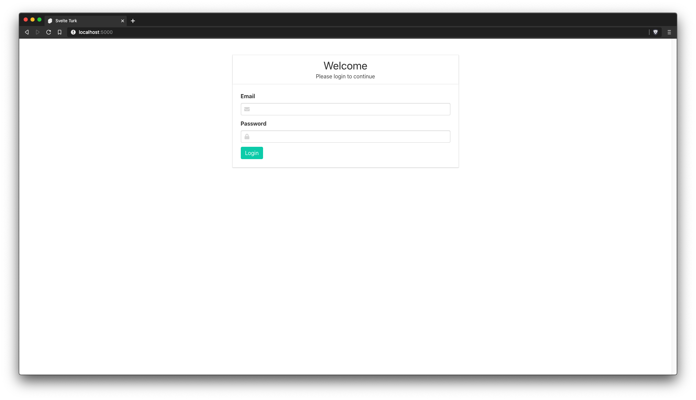
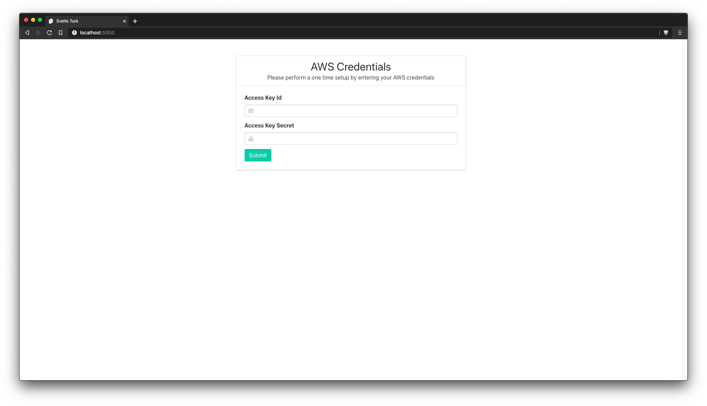
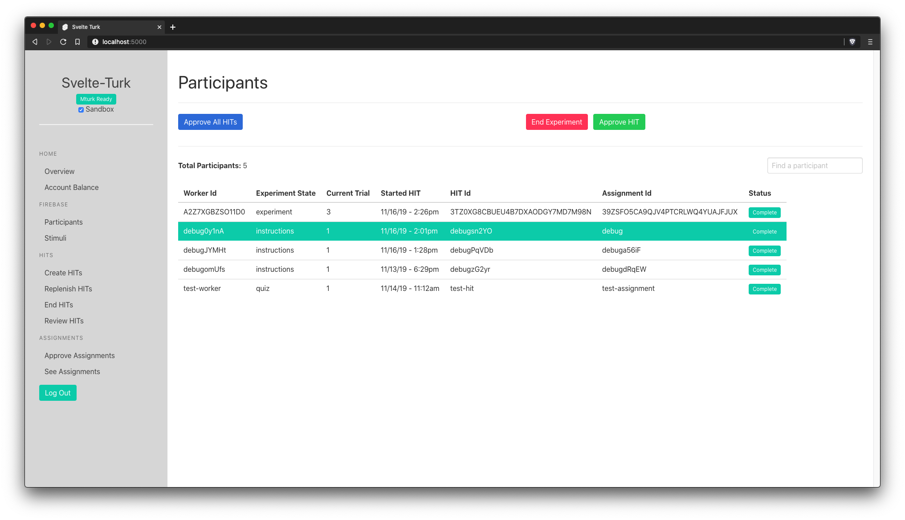
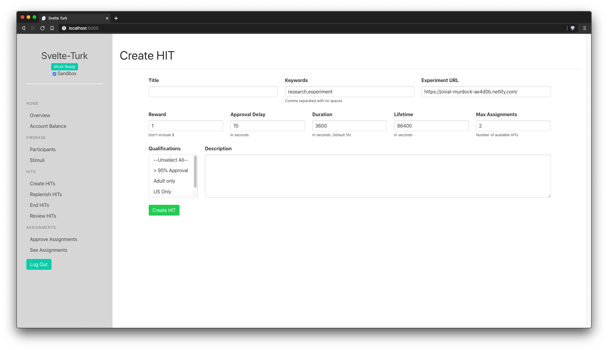

# Svelte-Turk

## 🚧 Work in Progress 🚧

## Assistance Welcome 💻

[Svelte](https://svelte.dev/) app for interacting with Amazon's Mechanical Turk and storing data in Firebase. Designed to be lightweight, offering a way to store data and interact with Mturk without all the complications of setting up a backend or database server. Hopefully this can grow into a viable simple alternative to something like [PsiTurk](https://psiturk.org/).  

- AWS has more-or-less unified their [APIs](https://docs.aws.amazon.com/AWSJavaScriptSDK/latest/) (including Mturk) and make much of their functionality available on the browser-side.   
- [Firebase](https://firebase.google.com/docs/reference/js) offers an easy way to read, write, and subscribe to a dynamic database from the browser alone.   
- [Netlify](https://www.netlify.com/) and similar providers like [Now](https://zeit.co/) and [Surge](https://surge.sh/) make it fast and easy to deploy and host a static web app.  
- Together these provide the bulk of the infrastructure needed to run modern web-applications without the need for server management  

This project is inspired by the server-less [JAMStack](https://jamstack.org/) architecture philosophy 

## Intended Usage

The project can provide a single static web-app that should be able to plug in to pretty much any other setup. That's because after a Svelte project is build, it produces just 3 files needed to run *everything*: `index.html`, `bundle.js`, and `bundle.css`. In theory you should be able to drop these files into any existing project (probably renaming `index.html` or something like `admin.html`) and then have a full administrative interface whenever you navigate to `youproject.com/admin`.

Alternatively you can use a local development server to run the app on your personal computer and perform Mturk administration without needing to worry about deploying or hosting any files. 

## Getting started

1. Install [npm](https://www.npmjs.com/get-npm) (if you don't have it)
2. Fork to your account on github
3. `git clone https://github.com/yourName/svelte-turk.git`  
4. `cd svelte-turk`
5. `npm install` 
6. Create a [firebase realtime database](https://firebase.google.com/docs/storage/web/start)\* and put the credentials into `config-example.js`. Rename that file to `config.js`. 
6. `npm run dev` and navigate to `localhost:5000` in your browser

At this point you should be able to fully administer Mturk from your personal computer. If you prefer to create static files that you add to another project or host online simple run `npm run build`. All the files you need will be in the `public/` folder!

\*Note: this project uses the realtime database rather than firestore. Make sure to configure the correct one!

 ## Screenshots

 
 
 
 

## Development

In theory this app is flexible enough that you could store the state of various experiments alongside Mturk data in firebase. The example screenshots demonstrate what that could look like if your main experiment site/app reported that state to the same firebase realtime database. You could also store experiment meta-data that would enable you to send events back to your experiment to trigger different states or end experiments early. 
## Dependencies  

- [Bulma Toast](https://github.com/rfoel/bulma-toast) for notification modals
- [Firebase](https://firebase.google.com/docs/reference/js) client-side library
- Loads in [Mturk Javascript API](https://docs.aws.amazon.com/AWSJavaScriptSDK/latest/) from a CDN
- Because Svelte is fundamentally a compiler other dependencies are only need during development!

