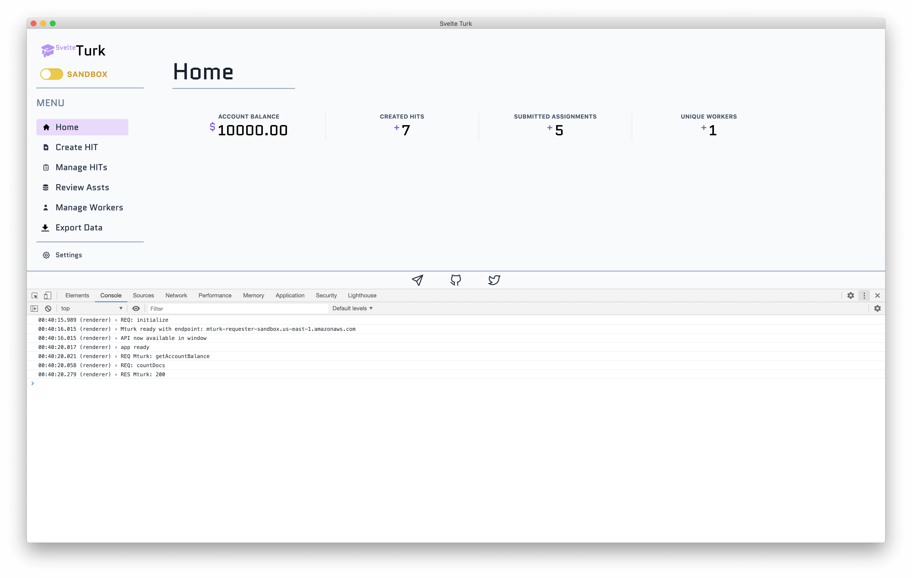
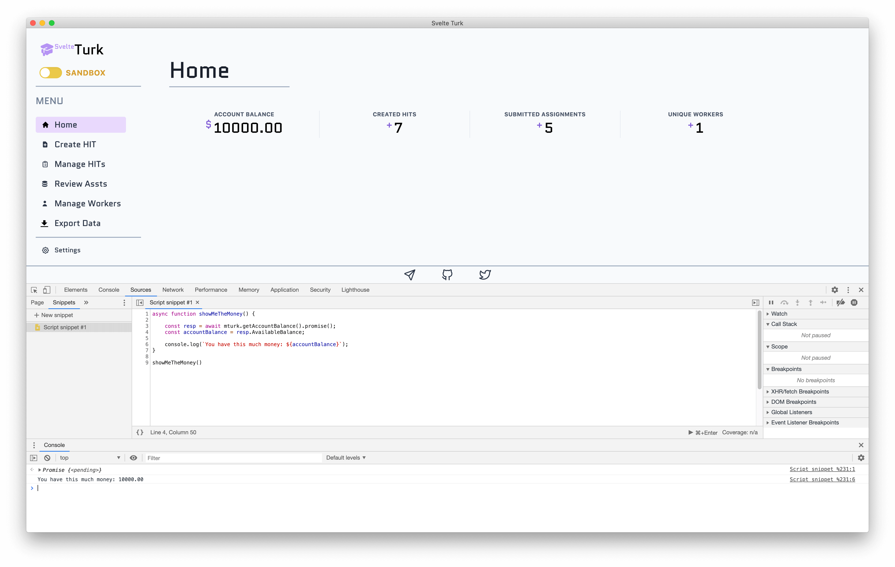
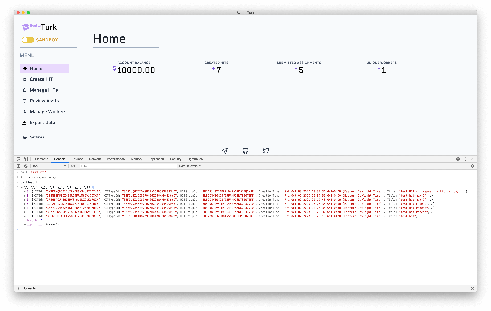

# SvelteTurk API

>[!NOTE]
> As progress on SvelteTurk continues this page will document details about programmatically executing commands in SvelteTurk.

Because SvelteTurk is built on [web technologies](https://www.electronjs.org/), you can access its console using  View > Toggle Developer Tools or by pressing `Cmd+Alt+I`. This will open up the browser console just like in Google Chrome. As SvelteTurk is running this console will print various messages. Sometimes opening this console can help you understand if something isn't quite working right. The logs are also saved to file in SvelteTurk's [data folder](settings.md#svelte-data-storage).

In it's current form SvelteTurk makes the entire [Mturk Javascript API](https://docs.aws.amazon.com/AWSJavaScriptSDK/latest/AWS/MTurk.html) available to you right from this console! This means you can *technically* interact with Mturk almost entirely through code without ever using SvelteTurk's user interface. This can be particularly handy by writing and save [code snippets](https://medium.com/@ishwar.rimal/running-javascript-snippets-with-chrome-dev-tool-94d541b22db3) in this developer console. You can create and save snippets by clicking on the following menu options in the console: Sources > >> Arrow > Snippets. From the left you can create a new snippet and save and run it by pressing `cmd+enter`. The picture below demos asking Mturk for your account balance using the API asynchronously. This is the same thing SvelteTurk is doing behind the scenes!

## Database calls

While currently undocumented ([but available for perusal on github!](https://github.com/ejolly/svelteturk/blob/master/main/main.js)) SvelteTurk offers two convenience functions for making and getting the results of asynchronous calls to its database. These are the `call()` function and `callResult` object. The image below demonstrates querying the database for all HITs.

