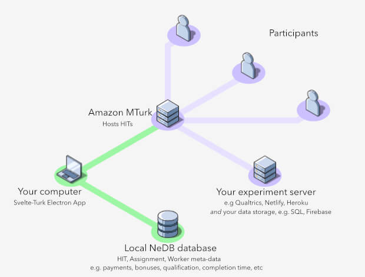

# Svelte Turk

🚧 *Under active development!* 🚧

### A graphical desktop application for interacting with Amazon Mechanical Turk

SvelteTurk aims to make it easy to create and manage HITs, Assignments, and Workers, without having to use Amazon's limited [requestor interface](http://requestor.mturk.com/) or write a single line of code. Think of it as a modern graphical alternative to projects like [psiTurk](https://psiturk.org/). Checkout the [quickstart](quickstart.md) guide to get up and running quickly or any of the pages in the usage guide for more details and help with SvelteTurk's functionality. This site also contains a brief but, helpful [glossary](_glossary.md) of Mturk terminology (e.g. a [HIT](_glossary.md#HIT)) which you can quickly jump to by clicking on a highlighted word. You can then use your browser's back button to quickly jump back to where you were.  

SvelteTurk development is open-source and rapidly on-going. It's currently being tested and used internally by the [Computational Social Affective Neuroscience Lab](https://cosanlab.com/) at the [Psychological and Brain Science Dept at Dartmouth College](https://pbs.dartmouth.edu/). Feel free to track progress on the [public roadmap](https://trello.com/b/Ha9M431u) and make feature requests, file bugs, or contribute to the code base via pull-requests [on github](https://github.com/ejolly/svelte-turk/issues/new). 

  

*Svelte-Turk only handles nodes and connections highlighted in green, namely the creation and management of HITs via communication with MTurk and a local database. It's up to you to build your experiment or survey and store appropriate data as see you see fit. (figure made with [isoflow](https://isoflow.io/))*

