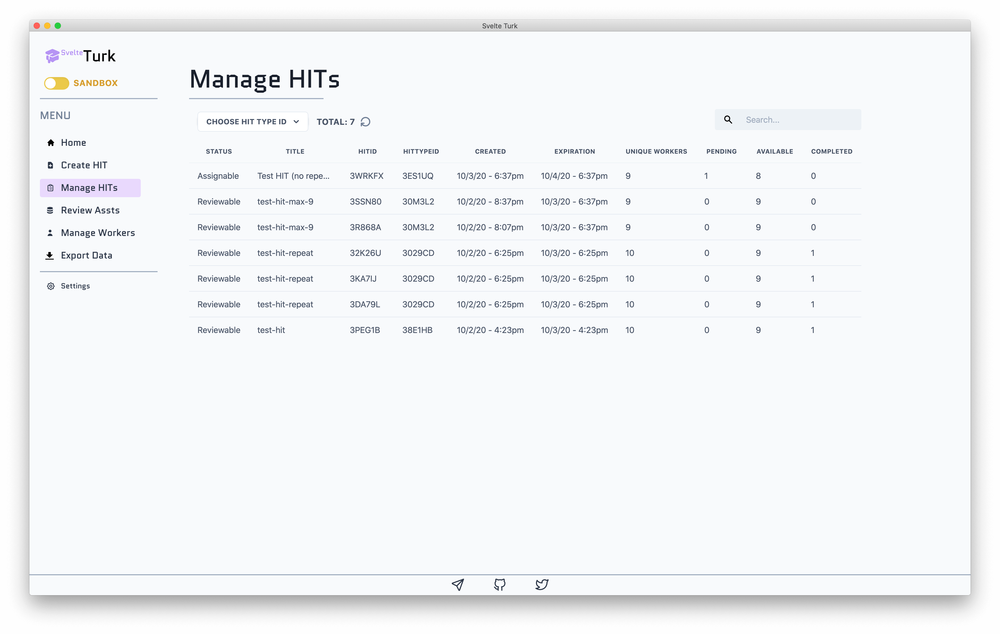
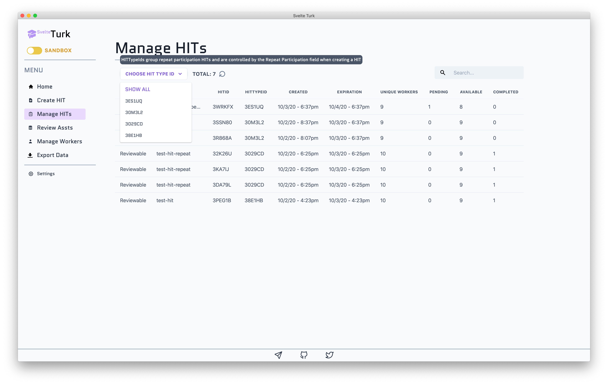
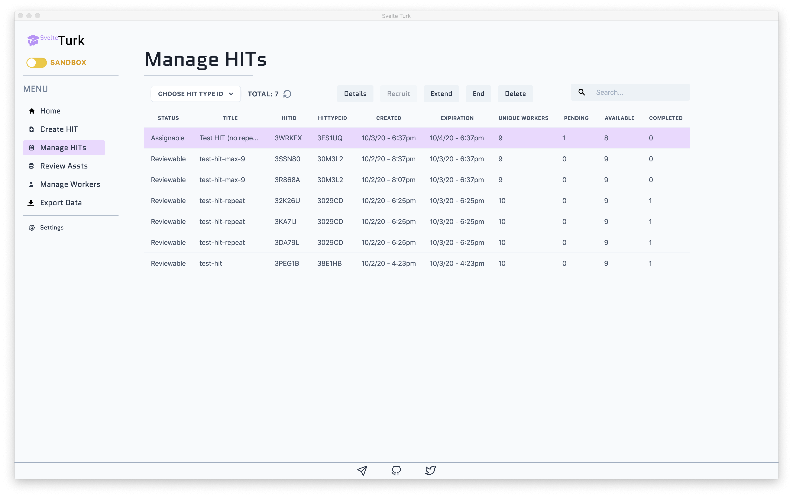
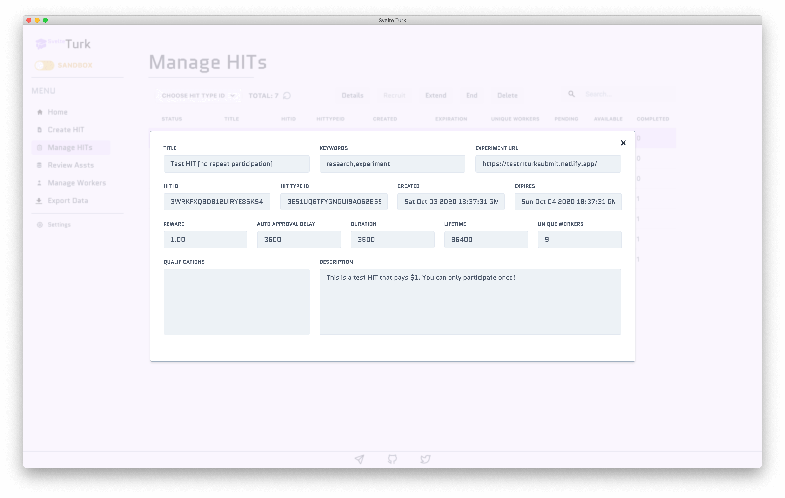

# Managing HITs

To help you manage your HITs, SvelteTurk renders a searchable table of all the HITs you've ever created via the [Create page](create.md). While this page is open, SvelteTurk will automatically pull the latest data about these HITs from Mturk at regular intervals. At the [bottom of this page](#column-descriptions) you can find a table that provides more detail about each column. 

> [!NOTE]
> SvelteTurk only refreshes Mturk data about the page you're **currently viewing,** rather than all data in the app. So while you're viewing the Manage HITs page, the latest data for **HITs,** but not Assignments or Workers, will be regularly refreshed. As soon as you switch to a different page, SvelteTurk will automatically start refreshing that page's data and pause refreshing data from other pages. Until Amazon offers a true realtime API, this prevents SvelteTurk from getting temporarily rate-limited from asking for new data. You can always manually refresh the data for page using the refresh icon at the top. This icon will automatically animate from time-to-time when SvelteTurk refreshes data in the background. You can control the refresh frequency from the [Settings](settings.md) (*default 30s*).

## Filtering by Repeat Participation or Search

By default the table displays all HITs irrespective of Repeat Participation. However, you'll notice in the images on this page that some rows share **the same HITTypeId**. These HITs appear to Workers as tasks they can **participate in more than once** (for more details about why see [here](mturk-basics.md)). You can filter the table by HITs that belong to the same group (i.e. allow Repeat Participation) using the dropdown menu. Each value in the dropdown menu displays the first few letters if each unique HITTypeId SvelteTurk knows about. As the tooltip above the dropdown indicates, the number of HITs listed for a specific HITypeId reflects the number of times a Worker can complete your task. You can additionally filter HITs by using the search field, which will query your search terms against all table columns.

## Taking actions on HITs

Clicking on any row in the table allows you to perform certain actions on the select HIT. 

### Details

The details button will bring up a read-only view of the same form you used when creating a HIT.

### Recruiting

The Recruit button allows you to open up the HIT to more **Unique Workers.** However, as noted on the [Create page](#repeat-participation-unique-workers-and-mturk-fees), SvelteTurk will prevent you from recruiting more than 9 additional Workers if you originally created the HIT with a Unique Workers value of 9 or less.

### Extending and Ending

Ending a HIT will immediately set its expiration date to the current moment. Use this option when you don't want to make your HIT available to anymore Workers.  

Extending a HIT will let you increase the Lifetime of a HIT so that it's available for completion beyond the Lifetime value you used when the HIT was first created. **It does not affect** the number of additional Unique Workers or Repeat Participation. Therefore, you should make sure the Available column is greater than 0 if you plan on extending a HIT.

### Deleting

Deleting a HIT will only delete its data from SvelteTurk's local database (i.e. your computer's harddrive). **It does not delete the HIT on MTurk.** This is primarily useful for removing old HITs after you've [exported SvelteTurk data](export.md) or to clean up the database from HITs you created in [sandbox mode](modes.md).

## Column descriptions

| Column Name    | Description                                                                                                                                                                                                                                                                                                                                                                                                      |
| -------------- | :--------------------------------------------------------------------------------------------------------------------------------------------------------------------------------------------------------------------------------------------------------------------------------------------------------------------------------------------------------------------------------------------------------------- |
| Status         | The current status of the HIT. Possible statuses include: **Assignable** (available to be accepted and completed); **Unassignable** (expired or no more tasks available); **Reviewable** (ended and any Workers have submitted their work); *Disposed* (HIT has been deleted on Amazon's servers). For more info see [this article](https://blog.mturk.com/understanding-hit-states-d0bc9806c0ee).               |
| Title          | The title you provided inputted on the Create HIT page.                                                                                                                                                                                                                                                                                                                                                          |
| HITId          | The unique identifier for this HIT provided by Mturk.                                                                                                                                                                                                                                                                                                                                                            |
| HITTypeId      | The unique identifier for the **group** of similar HITs this HIT belongs to. Groups are automatically determined by Mturk and correspond to the Repeat Participation value in SvelteTurk. You can filter by HITs that belong to the same group using the drop down menu above the table. The number of HITs listed per HITTypeId, are the number of times a single Worker can **repeatedly** complete your task. |
| Created        | The date and time this HIT was first created.                                                                                                                                                                                                                                                                                                                                                                    |
| Expiration     | The date and time this HIT expired and stopped being available for completion.                                                                                                                                                                                                                                                                                                                                   |
| Unique Workers | The number of unique Workers can that can accept and complete your task.                                                                                                                                                                                                                                                                                                                                         |
| Pending        | The number of Unique Workers that are currently completing your HIT but have not submitted it yet.                                                                                                                                                                                                                                                                                                               |
| Available      | The remaining number of additional Workers that can accept your task. This is equal to Unique Workers - (Completed + Pending).                                                                                                                                                                                                                                                                                   |
| Completed      | The number of Unique Workers that have completed your task and submitted it for approval.                                                                                                                                                                                                                                                                                                                        |