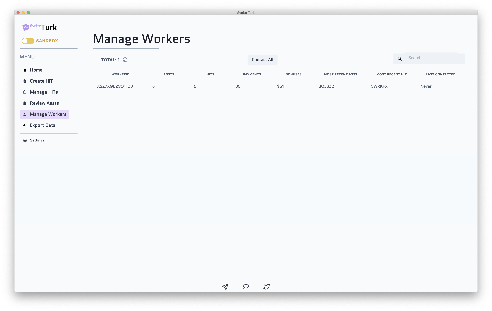
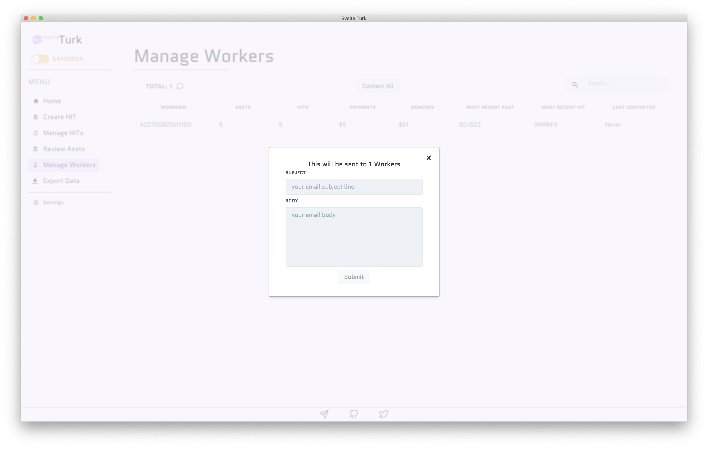

# Managing Workers

Similar to the HIT and Assignment tables, the Manage Workers page allows you to see a list of **unique Workers** who have completed HITs you have created using SvelteTurk. This is handy for seeing all Workers across all your tasks. Currently, SvelteTurk only allows you to contact Workers through this page, but future versions will also support granting and managing [Qualifications](https://blog.mturk.com/qualifications-and-worker-task-quality-best-practices-886f1f4e03fc). At the [bottom of this page](#column-descriptions) you can find a table that provides more detail about each column in the table. 

> [!NOTE]
> The same information about auto-refreshing HITs and Assignments also applies to auto-refreshing Workers data.

## Contacting Workers

You can also send an email to any Workers listed in this table by selecting the row containing their WorkerId and using the Contact button. You can also bulk message all workers by deselecting any rows and using the Contact All button.

Contacting a Worker(s) requires a subject and body which will be used to generate and send and email from your Requestor account, by Mturk. 

> [!WARNING]
> Due to restrictions imposed by Mturk, you can only email a Worker if they have previously submitted at least 1 Assignment for a HIT you have created. However, due to a limitation with their API, SvelteTurk will not be able to notify you if you try to contact a Worker who has never completed an Assignment for you. This will never typically happen except in 2 rare cases:
>
> 1. If a Worker submits an Assignment in the Mturk sandbox but not in the main marketplace, you will only be able to contact them while SvelteTurk is in [sandbox mode](modes.md) and visa versa. 
>
> 2. You have added WorkerIds to SvelteTurk's database that were never created by SvelteTurk itself and include Workers who have never completed any Assignments for the Requestor account you are using with SvelteTurk.

## Column descriptions

| Column Name            | Description                                                                                                                                                                                                                                                 |
| ---------------------- | :---------------------------------------------------------------------------------------------------------------------------------------------------------------------------------------------------------------------------------------------------------- |
| WorkerId               | The unique identifier for the Worker who completed your task provided by Mturk.                                                                                                                                                                             |
| Assignments            | The total number of Assignments this Worker has completed for you.                                                                                                                                                                                          |
| HITs                   | The total number of unique HITs this Worker has completed. This will equal the Assignments column if the Worker has only completed HITs without Repeat Participation. Otherwise, this value will be lower reflecting Repeat Participation of the same task. |
| Payments               | The sum total of all payments you have made to this Worker for Assignments managed by SvelteTurk.                                                                                                                                                           |
| Bonuses                | The sum total of all bonuses you have made to this Worker for Assignments managed by SvelteTurk.                                                                                                                                                            |
| Most Recent Assignment | The first few letters of the most recent submitted Assignment. This corresponds to the same Assignment Id as on the Review Assignments page.                                                                                                                |
| Most Recent HIT        | The first few letters of the HIT to for which the most recent Assignment was submitted. This correspond to the same HITId as on the Manage HITs page.                                                                                                       |
| Last Contacted         | The date and time you last sent an email to this Worker, or Never, if you never have.                                                                                                                                                                       |