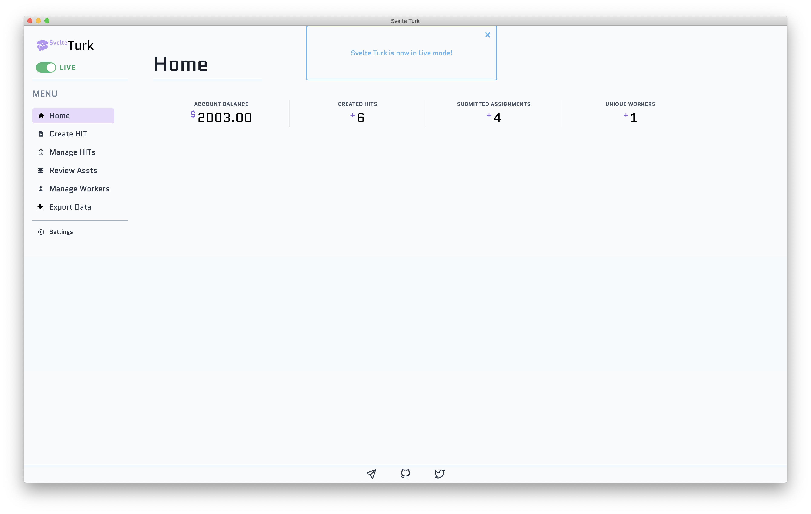

# Svelte Turk modes of operation

Using the toggle at the top of the sidebar, you can quickly switch between sandbox or live modes for interacting with Mturk. Switching modes on any page will automatically update data **for that mode.** For example, HITs created in sandbox mode won't show up in live mode. This also applies to Assignments and Workers.

### Sandbox mode

Sandbox mode is useful for testing HIT and Assignment creation and management. It functions in exactly the same way as live mode, but no money is ever drawn from your account. Instead your account will always have a balance of $10,000 and HITs created in this mode are only visible in the [worker sandbox](https://workersandbox.mturk.com/) so they cannot be completed in the regular Mturk marketplace. 

This mode is extremely useful for making sure your experiment or task works before going live. It's **highly recommended** you test your HITs before launching them live to ensure a positive experience for Workers and that your task is working as you expect it to (e.g. correct data collection, logic, no broken links, etc). Svelte Turk allows you to **fully test** HITs created in this mode including: HIT creation, management, Assignment approval, rejection, and bonus payments, and Worker contacting. 

> [!TIP]
> To help with testing external HITs you can use the dummy "experiment" created by the author of SvelteTurk. It was also used during testing and development of SvelteTurk! 
> Just paste the following address into the Experiment URL field on the [Create HIT](create.md) page: https://testmturksubmit.netlify.app/

### Live mode

To prevent any false starts, SvelteTurk will always launch in sandbox mode, and require you to manually toggle live mode. SvelteTurk will also display a popup letting you know whenever you're live and you'll see your account balance update in realtime on the [home page](overview.md#home-page). Live mode is the main [Mturk marketplace](https://worker.mturk.com/) where HITs are available for completion by any and all Workers. Make sure you are *absolutely certain* you want to create a HIT in live mode before toggling this on in Svelte Turk! **Approved assignments and bonuses paid in live mode will directly debit your account.** 
