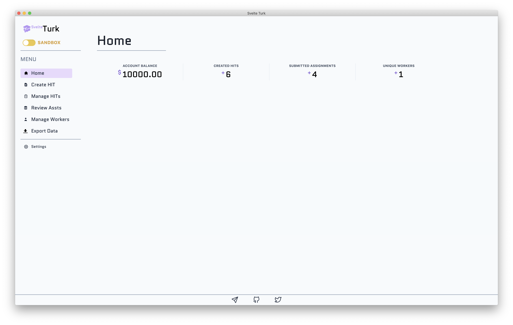

# Overview

SvelteTurk lets you create and manage HITs, approve and reject assignments, and contact and bonus Workers. **It does not** help you build surveys, tasks, or experiments. Instead it expects that you have already done so and that your task is reachable using a URL. See the [hosting options](custom-custom-experiments.md) page for some suggested approaches. All SvelteTurk data is stored **locally** on your computer. This keeps you from having to think about user privacy above and beyond how you're already storing and saving data. At the same time, it decouples services and software related to your task from how you manage and recruit Workers for that task. 
## Sidebar 

SvelteTurk's layout is organized with a sidebar on the left and a page view to the right. On successful startup, this view will always be the home page. The sidebar allows you to navigate between different pages in the app and take various actions including

- Switching between sandbox and live mode (*SvelteTurk always starts in sandbox mode*)
- Exporting all of SvelteTurk's data in `JSON` format
- Adjusting various app settings

## Page view

To the right of the sidebar is the pageview which will change based on your navigation. SvelteTurk always starts at the home page which displays an overview of your account including your account balance (*auto-updating when you switch between sandbox and live mode*), number of created HITs, number of submitted Assignments, and unique Workers. Click on the relevant page title in the Usage Guide to get more information about a specific page.

> [!NOTE]
> While your account balance is retrieved from Mturk in realtime, HIT Assignment and Worker counts only reflect data from actions you've performed using SvelteTurk. They do not reflect Mturk actions you've performed outside of SvelteTurk (e.g. directly creating a HIT from the Requestor site).

