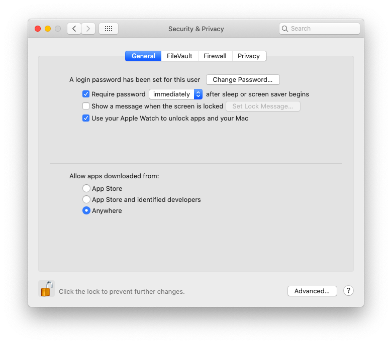

# Quick Start

 **1. Go to the releases page on [ github](https://github.com/ejolly/svelte-turk/releases) and download the latest release by clicking on *SvelteTurk-darwin-x64.zip***  
  - This will download a zip file to your desktop that you can double click on to unpack the SvelteTurk Application  
  - Move this Application to your `/Applications` folder (this is super important to make sure updating works properly!)
  - Double click the app icon you just moved to your `/Applications` folder to startup SvelteTurk
  - If you get a macOS warning about "Unidentified developer" follow the directions at the bottom of this page  

 **2. Download and configure your [AWS Mturk credentials](aws-credentials.md)**  

 **3. Check out the [ Overview page](overview.md) to see what SvelteTurk can and can't do and get a feel for the layout of the app**  

 **4. Dive into to the guides to learn how to [ Create](create.md) and [ Manage](manage-hits.md) HITs, [ Review](review-assts.md) Assignments, and/or [ Manage](manage-workers.md) Workers**  

## Unidentified Developer Warning

The current version of SvelteTurk was designed for quick updating and ease of use. However, this means there are certain restrictions, imposed by Apple, on what SvelteTurk can and can't do. If you see this warning when you try to open up SvelteTurk for the first time, it's because Apple is protecting you from using an app that wasn't downloaded from the macOS App store or isn't code-signed, i.e. "approved" by Apple. In general this is a *good thing* because it prevents malicious programs from harming your computer. However, it also means that developers have to pay a fee and jump through a few additional hoops in order to receive Apple's blessing.  If you're worried that SvelteTurk is doing something malicious, don't take my word for it, check out the [source code](https://github.com/ejolly/svelteturk) to prove to yourself that it's not! 

Fortunately Apple makes it relatively straightforward to get around this restriction. Doing so **will not** harm your computer, but will simply change the pop up macOS display to allow you run the app if you really want to, rather than completely blocking you from doing so. To change this restriction using the following steps and try launching SvelteTurk again:  

  - Search and open "System Preferences" using Spotlight
  - Go to "Security & Privacy"
  - At the bottom of the "General" in the "Allow apps downloaded from" section, click the bubble for "Anywhere." Your screen should look like the picture below
  - Just close this window to save your changes

  
