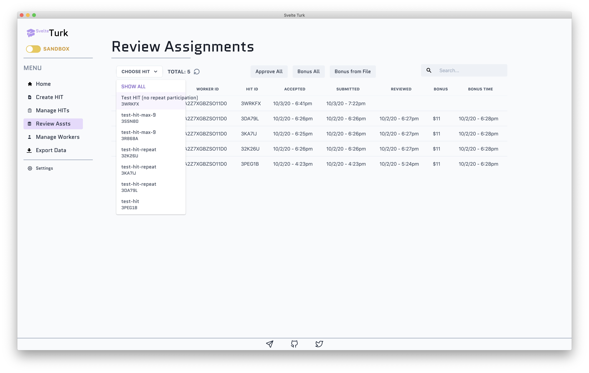
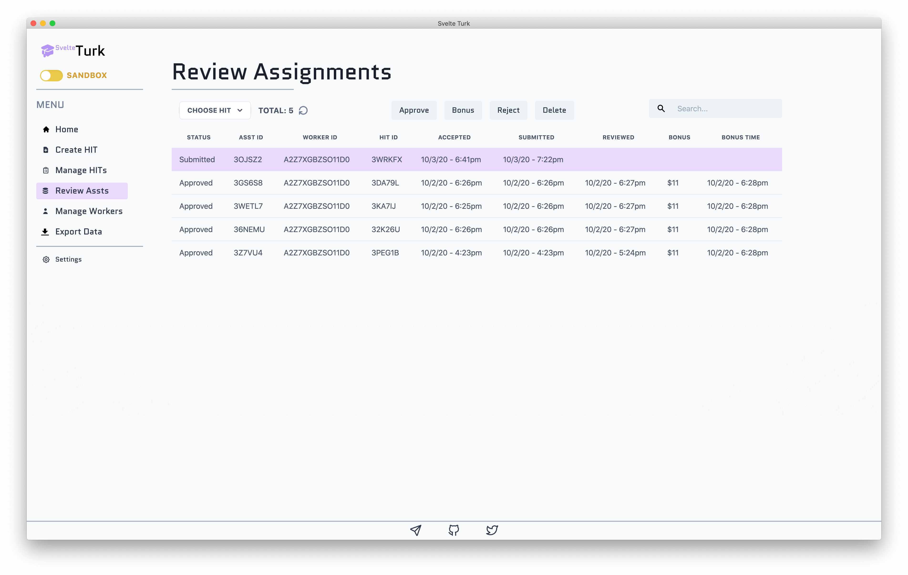
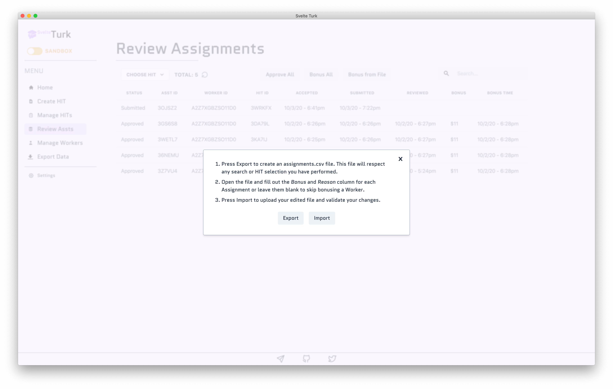
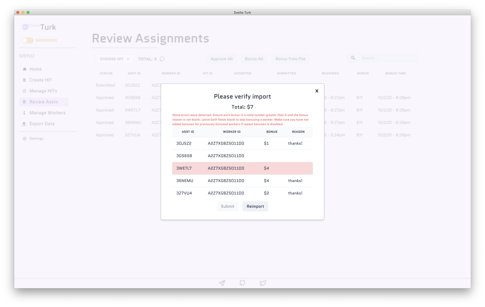
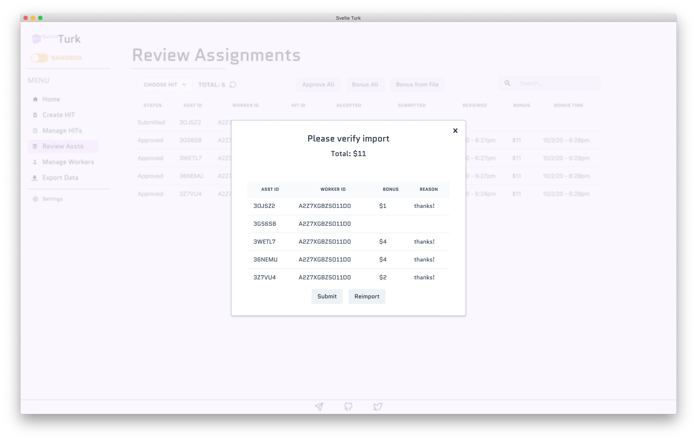

# Reviewing Assignments

Similar to the HIT table on the [managing hits page](manage-hits.md), SvelteTurk renders a table of of all the work ever submitted for the HITs you've created through SvelteTurk. Each row in this table reflects **a single submission by a single Worker.** Mturk refers to these units of work as Assignments. If a Worker can complete your task more than once, each submission will appear as a new row in the table, albeit wit the same WorkerId and HITId. These HITIds correspond to the same ones viewable on the [manage hits page](manage-hits.md). At the [bottom of this page](#column-descriptions) you can find a table that provides more detail about each column in the table. 

## Filtering Assignments by HITs or Search

To only see submissions for a particular task, you can use the dropdown menu to select the HIT you wish to filter by. To help you filter, the dropdown menu lists the title of the HIT and the first few letters of its HITId. You can additionally filter Assignments by using the search field, which will query your search terms against all table columns.

## Taking actions on Assignments

### Single operations

When you select a row SvelteTurk will allow you to perform actions on the selected Assignment only. These include Approving, Bonusing, and Rejecting the Assignment. 

> [!TIP]
> Unless absolutely necessary, you usually don't need to Reject an Assignment, especially if your task takes more than a few minutes. This is can be considered poor [Requestor etiquette](etiquette.md) and is unfair to Workers who put in the time to complete your task and deserve payment. Instead provide clearer directions or use Bonus payments to reward higher quality work while still providing baseline payments to all completed Assignments.

### Bulk operations

SvelteTurk lets you perform bulk operations on Assignments when you haven't selected any rows in the table. **Bulk operations respect search and HIT filters.** In other words, bulk operations are only performed on the Assignments you can see in the table. If you filter the table using the dropdown menu or search field, bulk operations will only affect the filtered Assignemnts. Bulk operations include Approving and Bonusing all visible Assignments. SvelteTurk does not support bulk Rejection. 

## Paying Bonuses

SvelteTurk aims to give you a high degree of control over how you bonus Workers for completed Assignments. You can send Bonuses in 3 distinct ways:

1. Select a row and use the Bonus button to pay a single bonus for a single Assignment  
2. Deselect any rows and use the Bonus All button to pay the **same bonus** to all visible Assignments (*SvelteTurk will tally your total payment*)  
3. Bonus Assignments selectively using a file as described below (*SvelteTurk will tally your total payment*) 

> [!NOTE]
> To prevent costly mistakes, the default setting in SvelteTurk does not allow you to bonus a Worker more than once. To change this, use the [Settings](settings.md) panel and check Allow Repeat Bonusing. 

### Using a Bonus File

Bonusing from a file allows you to choose exactly which Assignments to Bonus and how much. By clicking on the Bonus from File Button SvelteTurk will display a set of instructions for how to use a Bonus File. In this dialogue, first press the Export button to generate an `assignments.csv` file containing rows for each visible Assignment. Then update this file by entering values in the Bonus and Reason column to decide exactly to whom and how much to Bonus. **You can skip bonusing a Worker by leaving these values blank.** When you are finished simply click the Bonus From File Button again and choose Import to import the `assignments.csv` file you edited.

SvelteTurk will automatically verify this file upon import and tell you if it found any errors. Common errors include providing a Bonus value, but leaving the Reason column blank.

Just update the file to fix these errors and reupload to have SvelteTurk perform a bulk bonus action.

## Column descriptions

| Column Name  | Description                                                                                                                                                                                                                                                                                                                                                        |
| ------------ | :----------------------------------------------------------------------------------------------------------------------------------------------------------------------------------------------------------------------------------------------------------------------------------------------------------------------------------------------------------------- |
| Status       | The current status of the Assignment. Possible statuses include: **Submitted** (a Worker has completed your task, but is awaiting your review for approval and payment); **Approved** (you've approved the submission and the Worker has been paid their Reward); **Rejected** (a Worker's Assignment was not approved by you and they were not paid their Reward) |
| AssignmentId | The unique identifier for this Assignment provided by Mturk.                                                                                                                                                                                                                                                                                                       |
| WorkerId     | The unique identifier for the Worker who completed your task provided by Mturk.                                                                                                                                                                                                                                                                                    |
| HITId        | The unique identifier for the HIT that the Worker completed provided by Mturk.                                                                                                                                                                                                                                                                                     |
| Accepted     | The date and time this a Worker first accepted your HIT and started to work on it.                                                                                                                                                                                                                                                                                 |
| Submitted    | The date and time a Worker finished your HIT and submitted it for you review.                                                                                                                                                                                                                                                                                      |
| Reviewed     | The date and time this Assignment status changed from Submitted to Approved or Rejected. This could occur from manually Approving or Rejecting the Assignment, or after the Auto Approval Delay has elapsed.                                                                                                                                                       |
| Bonus        | The bonus (if any) paid for this Assignment.                                                                                                                                                                                                                                                                                                                       |
| Bonus Time   | The time the bonus (if any) was paid for this Assignment.                                                                                                                                                                                                                                                                                                          |